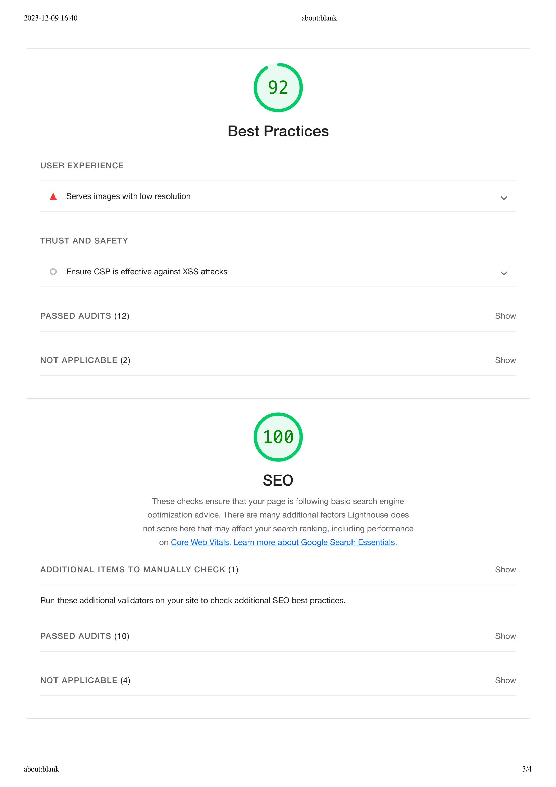
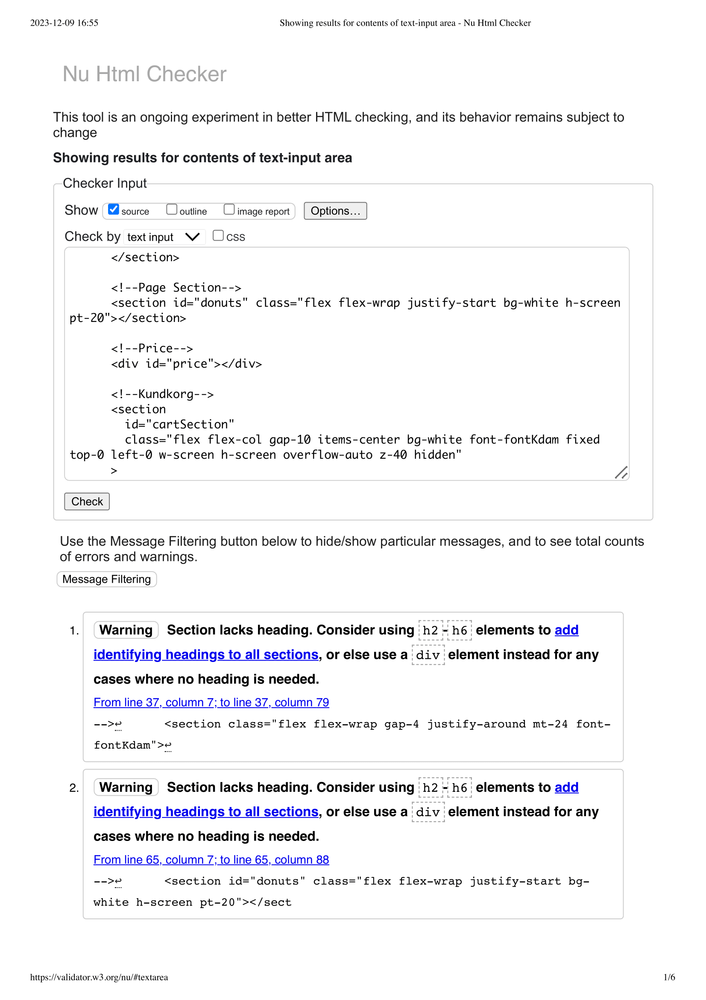

# Webbshop - Grundkurs i Javascript

## Beskrivning

Detta är mitt första projekt någonsin skrivet i JavaScript. Projektet gick ut på att skapa en webshopp om en valfri produkt, jag valde att skapa en butik om munkar. Jag strävade efter en stilren design för sidan, som är behaglig för ögat och inte skapar onödig mental belastning. I projektet så använde jag inga JS-ramverk, utan körde helt vanilla. I kompetenssyfte valde jag också att använda Tailwind för första gången.

## Länk till live-versionen av sidan

https://medieinstitutet.github.io/fed23d-js-grundkurs-webshop-Ogen1998/

## Funktioner

- Lägg till och ta bort munkar från kundvagnen.
- Beräkna totala kostnaden med rabatter baserat på mängden munkar.
- Möjlighet att betala med faktura eller kort.
- Validering av användarinformation före beställning.
- Enkelt sorteringssystem för munkarna.

## Teknologier

- JavaScript
- HTML
- Tailwind CSS
- Vite
- Prettier
- ESLint

## Screenshots

### Hemsidan

Det här är det första man ser när man öppnar upp sidan i desktopläge. Det är totalt 10 st munkar. Varukorgen ligger uppe till höger och man kan filtrera munkarna baserat på namn, kategori, betyg och pris.

 

Så ser sidan ut i mobilläge 

Om man klickar på en av "+"-knapparna för att lägga till en munk i varukorgen så kommer sidan ge en visuell feedback i form av att en liten orange cirkel dyker upp vid varukorgen där antalen står. Man får även upp den totala summan hittils i en liten orange ruta som också dyker upp i den nedre delen av skärmen(Anledningen till detta är för att kunden ska veta hur mycket summan ligger på utan att behöva klicka på varukorgen) Se bild nedan.

Jag har valt att använda färgen orange för att ge visuell feedback. Anledningen till det är att färgen är stark och markerar tydligt för användaren ändringarna som sker i sidan. Färgen dyker upp när man hoovrar över knapparna och även när man klickat på en av filtreringsknapparna. Se bild nedan.

### Kundvagn

Så här ser kundvagnen ut i sidan när den är tom

 

Så ser det ut när man lagt några donuts.

### Kundinformation och betalning

Här fyller kunden i sin information och väljer mellan två betallsätt, antigen kort eller faktura. Visuell feedback ges om kunden skriver felaktig information genom att det längst ner står vad som saknas samt att rutan som är felaktig markeras med rött. Här finns också en knapp för att återställa sin beställning

När man fyllt i korrekt info och allting stämmer, så kommer "betala"-knappen att aktiveras och kunden kan då genomföra sin beställning.

När man klickat i betala så får man fram en bekräftelse-ruta

## Lighthouse report

Klicka här

## HTML Validation

Klicka här

